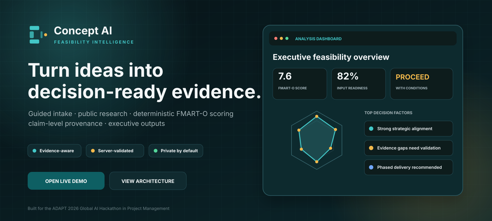
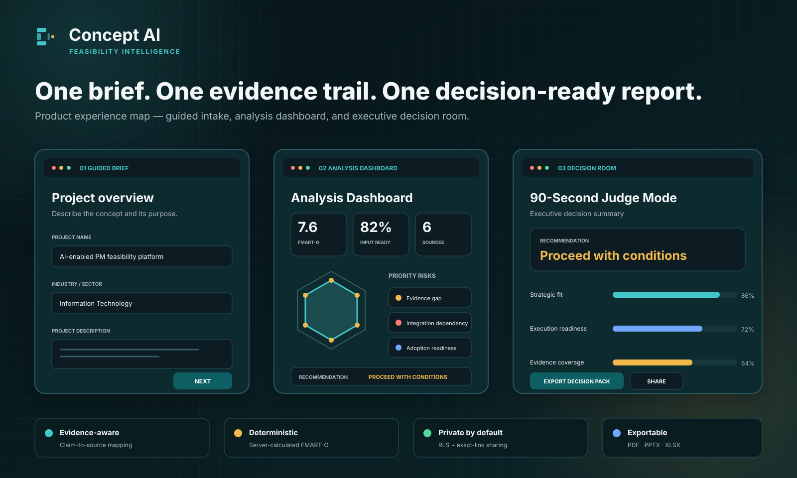
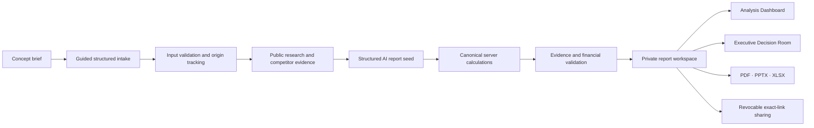
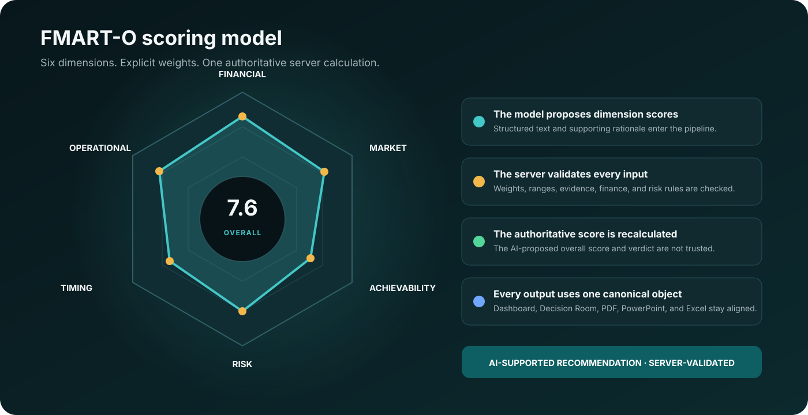
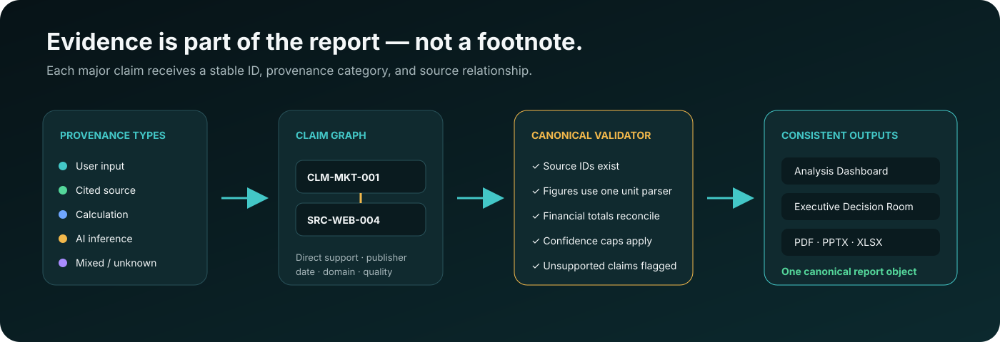
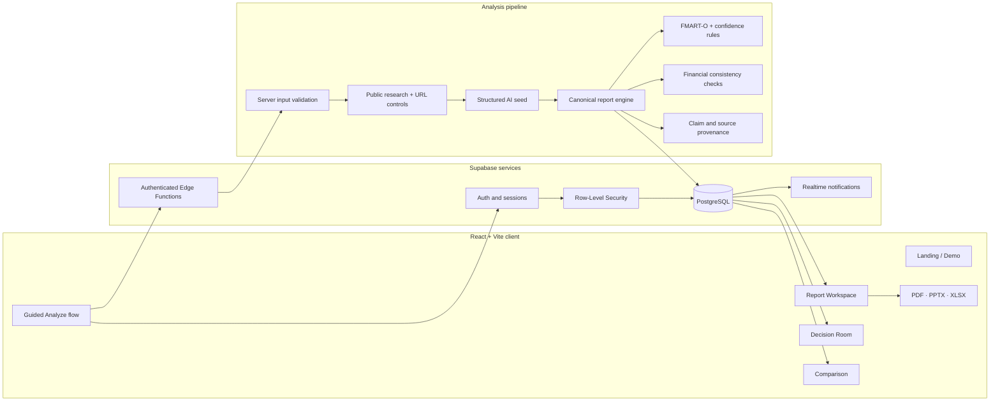
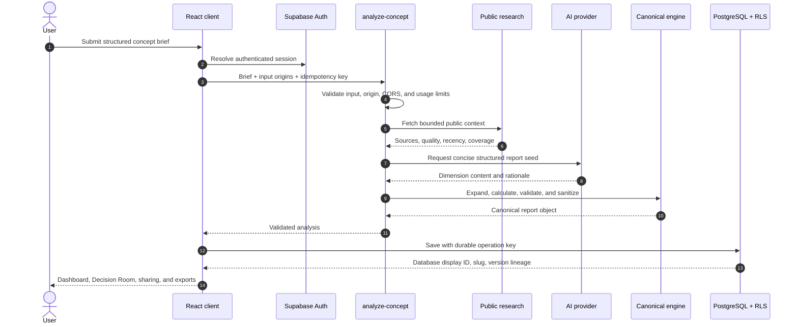

<p align="center">
  
</p>

<p align="center">
  <a href="https://gentle-glow-galaxy.lovable.app/demo"></a>
  <a href="https://gentle-glow-galaxy.lovable.app"></a>
  <a href="https://github.com/Nasser934/gentle-glow-galaxy/actions/workflows/ci.yml"></a>
</p>

<p align="center">
  
  
  
  
  
  
</p>

<h1 align="center">Concept AI</h1>

<p align="center">
  <strong>Evidence-aware feasibility intelligence for project and investment decisions.</strong><br />
  A guided concept brief becomes a researched, server-validated FMART-O report, an executive Decision Room, and consistent PDF, PowerPoint, and Excel decision packs.
</p>

<p align="center">
  <a href="https://gentle-glow-galaxy.lovable.app/demo"><strong>Explore the synthetic judge demo →</strong></a>
  ·
  <a href="#system-architecture"><strong>Architecture</strong></a>
  ·
  <a href="#run-locally"><strong>Run locally</strong></a>
  ·
  <a href="./docs/migration/LOVABLE_CLOUD_EXIT_RUNBOOK_AR.md"><strong>Backend ownership plan</strong></a>
</p>

---

## The decision problem

Teams often start with a short idea, a presentation, or an incomplete business case. The result is usually one of two extremes:

- a polished AI narrative with weak evidence and inconsistent figures; or
- a long manual feasibility process that is hard to repeat, compare, and audit.

**Concept AI turns that gap into a governed analysis pipeline.** It collects structured inputs, searches available public evidence, records provenance, calculates a deterministic six-dimension score, validates financial relationships, surfaces uncertainty, and produces an executive recommendation without presenting model output as unquestioned fact.

<table>
<tr>
<td width="25%"><strong>Structured intake</strong><br /><sub>Four guided steps with explicit review of AI suggestions.</sub></td>
<td width="25%"><strong>Evidence traceability</strong><br /><sub>Stable claim IDs, source IDs, quality classes, and recency metadata.</sub></td>
<td width="25%"><strong>Deterministic scoring</strong><br /><sub>The server recalculates the authoritative FMART-O score and verdict.</sub></td>
<td width="25%"><strong>Decision outputs</strong><br /><sub>Dashboard, Decision Room, PDF, PowerPoint, Excel, and controlled sharing.</sub></td>
</tr>
</table>

## Product experience

<p align="center">
  
</p>

### The path from idea to decision

<p align="center">
  
</p>

<p align="center">
  <sub>AI-generated concept visual for the README. It is illustrative only, not a product screenshot or a measured-result claim.</sub>
</p>

### From brief to board-ready decision



The AI helps draft and interpret. It does **not** own the final score. The canonical server pipeline validates and recalculates the decision object before the report can be saved.

## FMART-O: six dimensions, one controlled calculation

<p align="center">
  
</p>

| Dimension | What it examines |
|---|---|
| **Financial** | Investment range, CapEx, OpEx, funding, runway, and financial relationships. |
| **Market** | Need, market context, demand signals, competition, differentiation, and available evidence. |
| **Achievability** | Team, technology, dependencies, delivery complexity, and execution feasibility. |
| **Risk** | Severity, likelihood, critical blockers, mitigation readiness, and residual uncertainty. |
| **Timing** | Urgency, sequencing, implementation horizon, external timing, and schedule realism. |
| **Operational** | Operating model, adoption, support, governance, compliance, and ongoing capability. |

### What makes the score trustworthy

1. The model proposes dimension-level content and rationale.
2. The server validates ranges, weights, required structures, evidence coverage, and financial relationships.
3. The AI-proposed overall score and verdict are ignored as authoritative values.
4. The server calculates the final weighted score, applies governance rules, caps confidence, and stores audit metadata.
5. Every screen and export consumes the same canonical report object.

## Evidence is part of the report

<p align="center">
  
</p>

Every major claim receives a stable claim ID and one provenance category:

- **User input** — supplied directly in the concept brief.
- **Cited source** — supported by an identified external source.
- **Calculation** — produced by deterministic logic from recorded inputs.
- **AI inference** — analytical interpretation without direct external verification.
- **Mixed** — combines two or more provenance types.
- **Unknown** — insufficient provenance; the report must treat it cautiously.

Source records carry publisher, domain, publication date, type, quality, and a concise takeaway. Community discussions remain directional signals and are not treated as equivalent to official, regulator, academic, institutional, or primary evidence.

## Current product capabilities

| Area | Current MVP capability |
|---|---|
| **Guided analysis** | Four-step brief, field validation, industry templates, and explicit acceptance of AI suggestions. |
| **Input provenance** | Tracks user-entered, AI-suggested, accepted, and edited-after-suggestion fields. |
| **Research** | Tavily search, bounded public-source context, guarded competitor URL extraction, canonical URLs, and source-quality metadata. |
| **Scoring** | Deterministic FMART-O calculation with validated weights, governance rules, and scoring audit data. |
| **Financial controls** | CapEx and OpEx reconciliation, scenario probabilities, funding shares, investment ranges, currency consistency, and TAM ≥ SAM ≥ SOM checks. |
| **Decision workspace** | Analysis Dashboard, methodology, evidence, sensitivity, risks, comments, activity, status, and version lineage. |
| **Executive review** | 90-Second Judge Mode in the Decision Room with recommendation, readiness, blockers, and next actions. |
| **Comparison** | Side-by-side comparison for up to three owner-accessible reports or versions. |
| **Sharing** | Private by default, owner-controlled publication, exact-slug read-only public links, and immediate revocation. |
| **Exports** | Canonical PDF, PowerPoint, Excel, and a combined decision pack. |
| **Auditability** | Model ID, prompt version, scoring-engine version, input hash, generation timestamp, sources, request lifecycle, and status history. |
| **Demo** | Public synthetic demo that does not create a database row unless a signed-in user separately saves an analysis. |

## Executive surfaces

| Route | Purpose | Access |
|---|---|---|
| `/` | Product positioning and entry point. | Public |
| `/demo` | Synthetic read-only hackathon demonstration. | Public |
| `/auth` | Email/password and OAuth authentication. | Public |
| `/analyze` | Guided concept brief and analysis workflow. | Authenticated |
| `/reports/:reportId` | Owner report workspace and exports. | Owner |
| `/dashboard` | Report portfolio and lifecycle management. | Authenticated |
| `/compare` | Compare up to three accessible reports. | Authenticated |
| `/decision-room/:reportId` | Executive Decision Room / Judge Mode. | Owner; demo exception |
| `/r/:slug` | Exact-link read-only shared report. | Public only when published |

## System architecture

<p align="center">
  
</p>

<sub>The SVG includes animated flow particles. GitHub or browser accessibility settings may show a static frame. The technical diagram below carries the same architecture in searchable text.</sub>

<details>
<summary><strong>Open the searchable architecture diagram</strong></summary>



</details>

### Canonical analysis sequence



## Trust and security model

Security is enforced across the browser, Edge Functions, database privileges, RLS policies, and restricted RPCs.

### Data access

- Reports are **private by default**.
- Authenticated owners can read, update permitted fields, archive, restore, share, revoke, or delete their reports.
- Public reports are read through an exact-slug RPC rather than a table-wide public-select policy.
- Archived report lineages are private and cannot remain publicly shared.
- Comment, status-history, and limited profile reads are scoped to a single report the caller may view.
- Notifications and status history are trigger-owned; browser clients cannot fabricate audit records.

### Analysis controls

- Edge Functions require authentication and apply allow-listed CORS behavior.
- Requests use durable idempotency keys.
- Persistent rate limits apply by user, function, time window, and pseudonymous IP hash.
- Request logs retain privacy-safe lifecycle metadata rather than full concept briefs.
- Competitor URLs pass canonicalization and public-network checks before extraction.
- Canonical JSON validation occurs at both the application and database boundary.

### Financial and decision controls

- One unit-aware number parser handles common suffixes and supported currencies.
- Unsupported precision is labelled as an estimate or a validation requirement.
- Confidence is a constrained analysis indicator, not statistical certainty or guaranteed accuracy.
- Critical risk, evidence gaps, and weak inputs can cap confidence or alter the recommendation.
- The product says **AI-supported recommendation**, not autonomous approval.

## Technology stack

<table>
<tr>
<td width="33%" valign="top">
<strong>Frontend</strong><br /><br />
React 18<br />
Vite 8<br />
TypeScript 5.8<br />
React Router<br />
TanStack Query<br />
Tailwind CSS<br />
shadcn/ui + Radix UI<br />
Recharts<br />
Framer Motion
</td>
<td width="33%" valign="top">
<strong>Backend and data</strong><br /><br />
Supabase Auth<br />
PostgreSQL<br />
PostgREST<br />
Row-Level Security<br />
Realtime<br />
Deno Edge Functions<br />
SQL migrations<br />
pgTAP database tests
</td>
<td width="34%" valign="top">
<strong>Analysis and outputs</strong><br /><br />
Structured AI tool output<br />
Tavily public research<br />
Deterministic FMART-O engine<br />
Canonical report schema<br />
jsPDF<br />
PptxGenJS<br />
ExcelJS<br />
html2canvas
</td>
</tr>
</table>

## Repository map

```text
.
├── src/
│   ├── pages/                    Product routes and major experiences
│   ├── components/report/        Dashboard, evidence, sharing, comments, status
│   ├── contexts/                 Auth session state
│   ├── integrations/             Supabase client, generated types, current auth bridge
│   ├── lib/                      Canonical exports, evidence, numbers, validation
│   ├── test/                     Unit, integration, and end-to-end-style tests
│   └── types/                    Analysis and report domain contracts
├── supabase/
│   ├── functions/
│   │   ├── analyze-concept/      Research + AI seed + canonical report pipeline
│   │   ├── autofill-brief/       Reviewable brief suggestions
│   │   ├── complete-field/       Reviewable single-field suggestion
│   │   └── _shared/              Security, scoring, evidence, finance, research
│   ├── migrations/               Forward-only database changes
│   ├── tests/database/           RLS and database policy tests
│   └── config.toml               Supabase project/function configuration
├── docs/
│   ├── migration/                Backend ownership and Lovable Cloud exit runbook
│   ├── plans/                    Hackathon hardening design and implementation plans
│   └── assets/readme/            README visual assets
├── scripts/                      Static Edge Function checks
└── .github/workflows/ci.yml      Application and database verification
```

## Run locally

### Requirements

- Node.js **20.19.5 or newer**
- npm
- Docker, only for local Supabase/database tests
- Supabase CLI, optional for local backend work

### Install and start

```bash
git clone https://github.com/Nasser934/gentle-glow-galaxy.git
cd gentle-glow-galaxy
npm ci
npm run dev
```

Open the local URL printed by Vite.

### Frontend environment

Create a local environment file with the public client configuration for your Supabase project:

```env
VITE_SUPABASE_URL="https://YOUR_PROJECT_REF.supabase.co"
VITE_SUPABASE_PUBLISHABLE_KEY="YOUR_PUBLIC_PUBLISHABLE_OR_ANON_KEY"
VITE_SUPABASE_PROJECT_ID="YOUR_PROJECT_REF"
```

The browser key is public by design. Access control depends on correctly tested RLS policies. Never expose the service-role key in Vite variables or client code.

### Edge Function configuration

The current runtime uses these secret/configuration names:

```text
LOVABLE_API_KEY
TAVILY_API_KEY
ANALYSIS_MODEL_ID
AUTOFILL_MODEL_ID
COMPLETE_FIELD_MODEL_ID
ALLOWED_ORIGINS
RATE_LIMIT_HASH_SALT
```

`ANALYSIS_MODEL_ID`, `AUTOFILL_MODEL_ID`, and `COMPLETE_FIELD_MODEL_ID` are optional overrides where supported by the corresponding function. Secret values must remain in the backend secret store, never in Git.

> The repository includes a staged plan to replace Lovable-specific Auth and AI dependencies with user-owned Supabase Auth and a provider-independent AI adapter. See [the migration runbook](./docs/migration/LOVABLE_CLOUD_EXIT_RUNBOOK_AR.md).

## Verification

Run the same application checks used by CI:

```bash
npm ci
npm run lint
npm run typecheck
npm run check:edge
npm run test
npm run build
```

Run local migrations and database/RLS tests:

```bash
npx --yes supabase@2.109.1 start \
  -x studio,imgproxy,inbucket,vector,logflare,supavisor

npx --yes supabase@2.109.1 test db \
  supabase/tests/database/rls_hackathon.sql
```

### Test coverage areas

- FMART-O scoring and authoritative score recalculation
- confidence caps and governance rules
- financial consistency and unit-aware number parsing
- evidence composition, claim provenance, and research quality
- SSRF/public-URL protections
- deterministic scenario simulation and sensitivity
- input validation and field-origin tracking
- auth return-path handling
- report save idempotency and version comparison
- private/public sharing behavior
- canonical PDF, PowerPoint, and Excel consistency
- synthetic demo consistency
- database privileges and RLS policies

## Judge demo: 90 seconds

1. Open the [synthetic public demo](https://gentle-glow-galaxy.lovable.app/demo).
2. Confirm the synthetic-data labels; the demo does not represent a real customer outcome.
3. Review the project brief, authoritative FMART-O score, recommendation, confidence, and validation warnings.
4. Inspect financial assumptions, major risks, evidence coverage, and claim provenance.
5. Open **90-Second Judge Mode** in the Executive Decision Room.
6. Return to the report workspace and generate a PDF, PowerPoint, or Excel export.
7. Note that the demo is read-only and does not create a database row by itself.

## Product truth: what Concept AI does not claim

The current MVP does **not** claim:

- trained predictive cost or schedule models;
- statistically calibrated accuracy or guaranteed outcomes;
- historical organization learning;
- production ERP, PPM, ServiceNow, Primavera, or Microsoft Project integrations;
- enterprise organizations, portfolios, autonomous approvals, or tenant governance;
- independent Finance, Market, Risk, or Product agents;
- proven production adoption, paying customers, or measured time-reduction results.

These are roadmap possibilities, not current product capabilities. The current access model is an authenticated user workspace with report ownership and revocable public review links.

## Backend ownership and migration

Concept AI is being prepared to move from Lovable Cloud to infrastructure owned and controlled by the project team. The source-controlled migration package covers:

- database export and test restoration;
- Auth users and OAuth configuration;
- Storage object migration;
- Edge Function deployment and secrets;
- AI Gateway replacement;
- schema reconciliation and regenerated types;
- CI/CD, acceptance testing, cutover, and rollback;
- a mandatory no-delete checklist before Lovable Cloud removal.

Read the documentation:

- [Current system inventory — Arabic](./docs/migration/CURRENT_SYSTEM_INVENTORY_AR.md)
- [Lovable Cloud exit and Supabase migration runbook — Arabic](./docs/migration/LOVABLE_CLOUD_EXIT_RUNBOOK_AR.md)

## Hackathon team

Concept AI was prepared for the **Global AI Hackathon in Project Management — ADAPT 2026**, organized by the Project Management Association in Saudi Arabia.

| Team member |
|---|
| Nasser Al Idris |
| Ahmad Almuslami |
| Adel Al-Modhhi |
| Ammar Aburas |
| Felwa Alsubai |

## Design principles

- **Truth before polish.** Unsupported claims remain labelled and visible.
- **Calculation before confidence.** The server recalculates the authoritative result.
- **Evidence before certainty.** Source quality and missing support affect the recommendation.
- **Private before shared.** Reports start private; owners explicitly publish and revoke links.
- **One canonical object.** Screens and exports must tell the same story.
- **Human decision ownership.** Concept AI supports a decision; it does not approve one.

## License and use

This repository is **proprietary**. All rights are reserved. Public repository access does not grant permission to copy, redistribute, sublicense, commercialize, or reuse the product, design, scoring method, prompts, or implementation except with written authorization from the owner.

---

<p align="center">
  <strong>Concept AI</strong><br />
  <sub>From an incomplete idea to an evidence-aware, reviewable decision.</sub>
</p>
